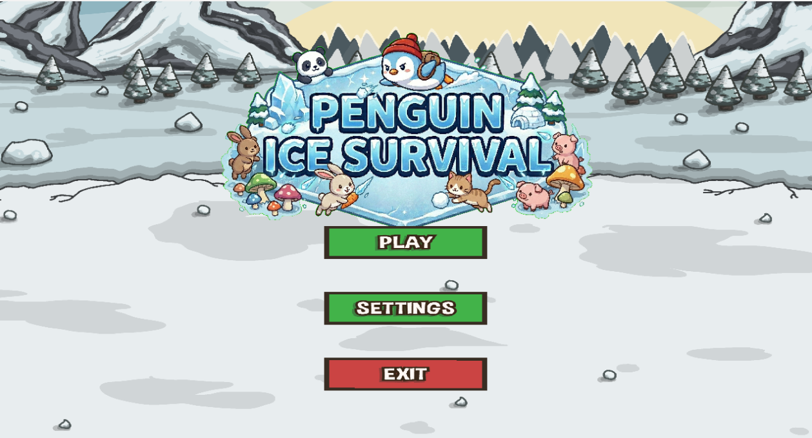
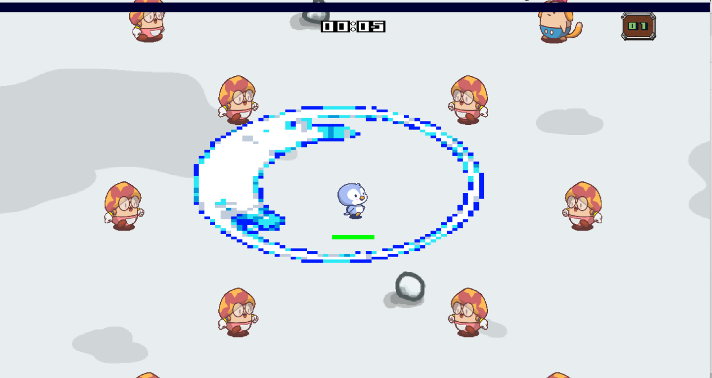
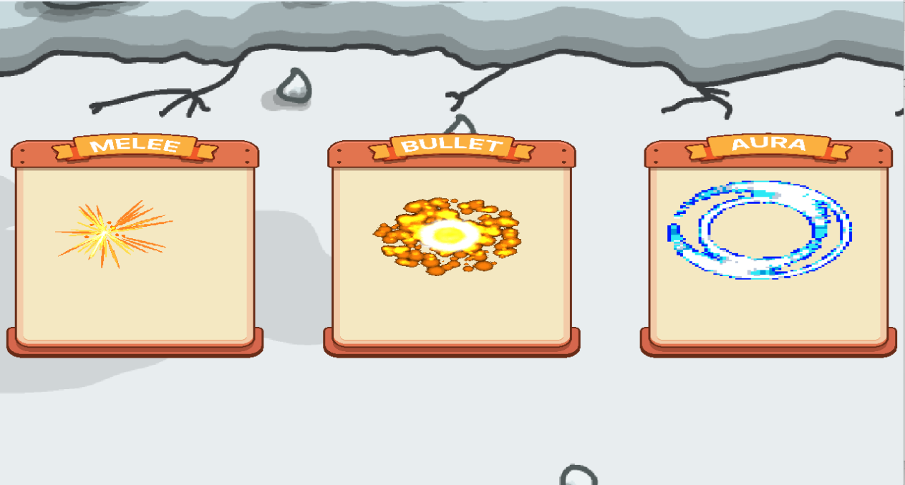
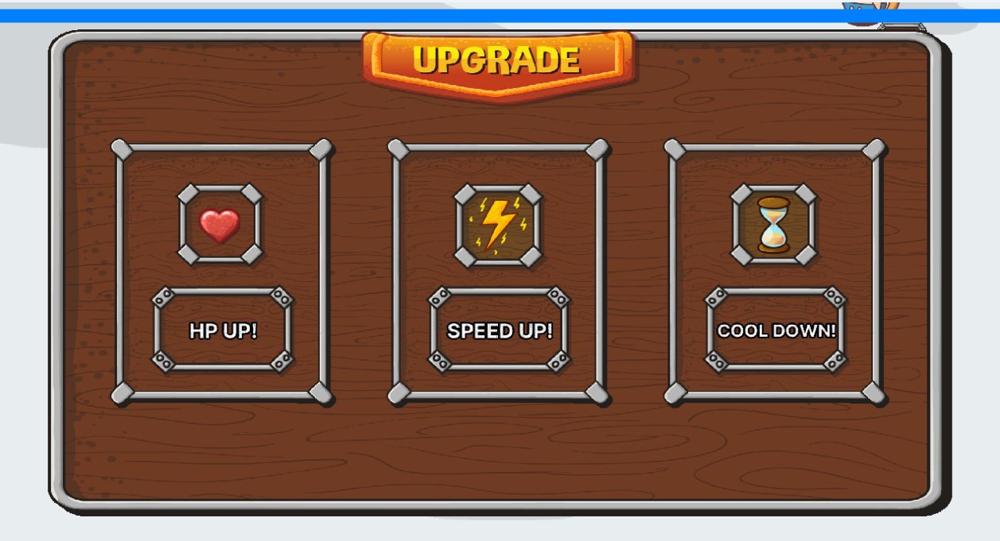

$ 🐧 Penguin Ice Survivors (DirectX 12 기반 2D 타임 서바이벌 게임)

- Penguin Ice Survivors는 C++과 DirectX 12 로우레벨 API를 활용하여 직접 엔진을 구축해 개발한 2D 탑다운 타임 서바이벌 게임입니다.
- 사방에서 몰려오는 적들을 처치하고, 경험치를 모아 무기를 강화하며 5분 동안 생존하는 것이 목표입니다.

## 🎮 게임 흐름 및 플레이 방식

- 무기 선택 (Weapon Select): 게임 시작 시 근접 무기, 유도탄, 오라 중 하나의 무기를 선택하여 시작합니다.

- 전투 및 파밍 (Combat & Farming): 시간이 지날수록 적들이 거세게 몰려옵니다. 적을 처치하고 드롭되는 '경험치 젬'을 획득해야 합니다.

- 레벨업 및 성장 (Level Up): 경험치 바가 가득 차면 게임이 일시 정지되며, 3개의 무작위 강화 카드(체력 회복, 이속 증가, 공격력 증가, 쿨타임 감소, 오라 범위 증가) 중 하나를 선택할 수 있습니다.

- 보스전 및 클리어 (Boss Wave): 1분 단위로 중간 보스가 등장하며, 4분 30초에 등장하는 최종 보스를 처치하면 게임을 클리어합니다.

## 🛠 핵심 기능 (Features)

### 3가지 고유 무기 시스템:

- Melee (근접): 플레이어가 바라보는 방향으로 타격 판정이 발생하는 기본 무기

- Bullet (유도탄): 가장 가까운 적을 자동으로 추적하여 타격하는 투사체 무기

- Aura (오라): 플레이어 주변의 일정 반경 내에 있는 모든 적에게 지속 데미지를 입히는 광역 무기

- 동적 난이도 조절 (Dynamic Scaling): 생존 시간이 길어질수록 몬스터의 체력이 선형적으로 증가하며, 웨이브 패턴(원형 포위, 양각, 난전 등)이 변화합니다.

- 군집 AI (Flocking): 수많은 몬스터가 플레이어를 향해 이동할 때, 서로 겹치지 않도록 자연스럽게 밀어내는 물리 연산이 적용되어 있습니다.

## 💻 기술적 특징 (Technical Highlights)
본 프로젝트는 상용 엔진(Unreal, Unity)을 사용하지 않고 DirectX 12 API를 직접 다루며 게임 엔진의 기초 구조를 설계하고 최적화하는 데 집중했습니다.

## 최적화 및 메모리 관리 (Flyweight & Object Pooling)

- 오브젝트 풀링 (Object Pooling): 최대 60마리의 적, 50개의 탄환, 200개의 경험치 젬 등을 미리 생성해두고 isDead 플래그를 통해 재사용함으로써 런타임 중의 동적 메모리 할당(new/delete) 부하를 제거했습니다.

- 플라이웨이트 패턴 (Flyweight Pattern): 동일한 외형을 가진 몬스터들이 각자 텍스처를 로드하지 않고, 마스터 스킨 객체의 ID3D12Resource와 SRV Heap을 공유(ShareTextureFrom)하도록 설계하여 VRAM 사용량과 로딩 속도를 획기적으로 개선했습니다.

- 상태 기계 기반 씬 관리 (FSM)

- GameState 열거형(TITLE, WEAPON_SELECT, PLAY, LEVEL_UP, PAUSE 등)을 통해 복잡한 화면 전환과 렌더링 레이어 순서를 안전하게 제어합니다.

- HLSL 셰이더 및 공간 변환 (Rendering Pipeline)

- 위치, 크기, 회전 정보를 담은 상수 버퍼(Constant Buffer)를 매 프레임 GPU로 전송합니다.

- 픽셀 셰이더(Pixel Shader) 내부에서 알파값(Alpha)을 활용한 클리핑(Clip)과 틴트 컬러(Tint Color) 곱연산을 통해, 피격 시 빨간색으로 깜빡이는 효과나 UI의 투명도를 구현했습니다.

- 커스텀 오디오 엔진 (XAudio2)

    - SoundManager 클래스를 구현하여 .wav 파일을 직접 파싱하고 버퍼에 로드합니다. XAudio2의 SourceVoice를 활용해 BGM 무한 반복 재생 및 다중 효과음 재생을 처리합니다.

## 🕹 조작법 (Controls)
W, A, S, D / 방향키: 플레이어 이동

마우스 좌클릭: UI 메뉴 및 레벨업 카드 선택

ESC: 일시 정지 (메인 메뉴 및 설정 접근)

## 📁 의존성 및 라이브러리 (Dependencies)
DirectX 12 API / XAudio2 (Windows SDK)

d3dx12.h: DirectX 12 헬퍼 라이브러리

stb_image.h: PNG 이미지 디코딩 및 로드